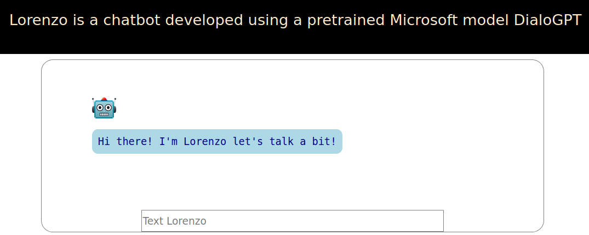

***ChatBot Lorenzo*** 

Lorenzo is a chatbot built using the awesomeness of Transformers library and Microsoft’s Large-scale Pretrained Response Generation Model (DialoGPT). Try to talk to Lorenzo he is still learning.

How to run Lorenzo: 

In your terminal run the command `python3 main.py`. Here **Flask** comes to the play. It will create an instance of web application that starts on (default) `localhost:5000`. Navigate to `home` like this `localhost:5000/home` and you will have this page:  

